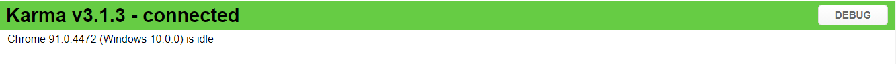

# Setup & Best Practices

:::info
The Angular CLI comes equipped with the Jasmine test framework.
No additional packages need to be installed to start testing.
:::

## Setup

### Test file naming

Test files must have a ``spec.ts`` extension. If the component is named ``example.component.ts``, the test file for this component should be named ``example.component.spec.ts``.

### Unit test file placement

Unit test spec files should be placed in the same folder as the application source code files they are testing.

[Angular docs](https://angular.io/guide/testing#place-your-spec-file-next-to-the-file-it-tests) say this is a good idea because:
* Such tests are easy to find.
* You see at a glance if a part of your application lacks tests.
* Nearby tests can reveal how a part works in context.
* When you move the source (inevitable), you remember to move the test.
* When you rename the source file (inevitable), you remember to rename the test file.

### Integration test file placement

Because integration tests look at interactions between multiple parts (which may be placed in different folders), it is best to make a dedicated test folder for these files in the `tests` directory.

### Script to run tests

Tests can be run with the Angular CLI command `ng test`. This builds the applicaiton in watch mode and launches the Karma test runner in a browser window.

It is best to run them with `npm test` because the script can be configured in the project with additional flags. In the [Unit Testing in Angular](https://app.pluralsight.com/library/courses/unit-testing-angular) course by Joe Eames, he recommends using the `--source-map=false` flag to avoid some errors.

If using Windows Subsystem for Linux, Karma will show a warning:

```
WARN [karma]: No captured browser, open http://localhost:9877/
```

You'll need to click into Debug on the page and refresh manually:



## Best Practices

### Using the console

Open the console with `Ctrl + Shift + I` to see additional error messages that may not be displayed in the browser.

### Tests as stories & their structure

In his course [Joe Eames](https://app.pluralsight.com/library/courses/unit-testing-angular) advises to view tests as stories: make them readable with a clear structure.

The conventional structure is ** Arrange, Act, Assert**.

1. Arrange all necessary preconditions and inputs.
2. Act on the object or class under test.
3. Assert that the expected results have been achieved.


